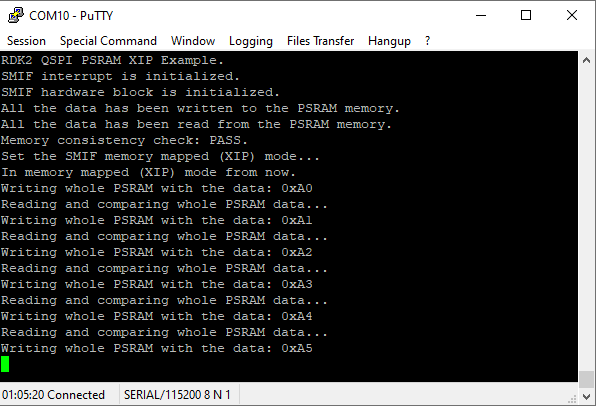
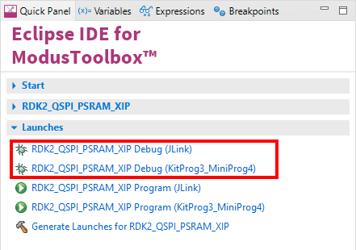

# RutDevKit-PSoC62 QSPI PSRAM XIP Example

Rutronik Development Kit Programmable System-on-Chip CY8C6245AZI-S3D72 "QSPI PSRAM XIP" Example. 

This example demonstrates how to configure and use PSRAM APS6404L-3SQR-ZR  in XIP mode.

 

### Using the code example with a ModusToolbox IDE:

1. Import the project: **File** > **Import...** > **General** > **Existing Projects into Workspace** > **Next**.
2. Select the directory where **"RutDevKit-PSoC62_QSPI_PSRAM_XIP"** resides and click  **Finish**.
3. Select and build the project **Project ** > **Build Project**.

### Operation

The PSRAM is tested additionally before entering the XIP mode. Testing is done with writing and reading the memory using SMIF PDL functions. If data comparison is succeeded the XIP mode is entered and the write/read/compare in XIP mode process starts and continues indefinitely at full speed with a whole 8MB of PSRAM memory. If error during the data comparison is found it will be printed out to the terminal.

The QSPI interface in configured using HAL library and the SMIF is configured and initiated using PDL libraries in the function:

`void Init_SMIF(void)`

The APS6404L-3SQR-ZR PSRAM memory configuration structures are generated by the "QSPI Configurator":

### Debugging

If you successfully have imported the example, the debug configurations are already prepared to use with a the KitProg3, MiniProg4, or J-link. Open the ModusToolbox perspective and find the Quick Panel. Click on the desired debug launch configuration and wait until the programming completes and debugging starts.

## Legal Disclaimer

The evaluation board including the software is for testing purposes only and, because it has limited functions and limited resilience, is not suitable for permanent use under real conditions. If the evaluation board is nevertheless used under real conditions, this is done at one’s responsibility; any liability of Rutronik is insofar excluded. 

